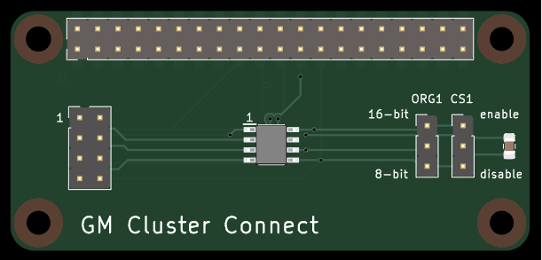

# GM-Cluster-Connect
GM Cluster Connect is a dedicated Raspberry Pi HAT designed for interfacing with and programming automotive EEPROM chips (specifically the M93 series) commonly found in GM instrument clusters.



This project provides a hardware platform and a Python-based utility to read full-chip binary dumps and write backups back to new EEPROM chips, allowing for cluster restoration and maintenance.

## Features
* **Dedicated Hardware HAT:** Custom PCB layout for Raspberry Pi featuring:
  * Direct SPI interfacing via GPIO.
  * Configurable jumpers for ORG (mode selection) and CS (Enable/Disable).
  * Decoupling capacitor footprint for signal stability.

* **Python EEPROM Controller:** Command-line utility to:
  * Perform full-chip reads/dumps to .bin files.
  * Flash binary files back to the chip.
  * Support for 8-bit and 16-bit Microwire modes.

## Hardware Configuration
**WARNING:** This tool interacts with critical vehicle hardware. Ensure all connections are secure before powering the Pi.
* **ORG Jumper:** Set to **GND** for 8-bit operation (default).
* **CS Jumper:** Must be in the **ENABLED (HIGH)** state to permit read/write operations.

## Setup & Installation

### Prerequisites
Run the following commands on your Raspberry Pi to prepare the environment and enable SPI:

```cmd
sudo apt update && sudo apt install -y python3-pip python3-spidev
sudo raspi-config nonint do_spi 0
sudo reboot
```

## Usage

The eeprom_controller.py script provides a simple CLI interface.

### Dump EEPROM to file

```cmd
python3 eeprom_controller.py --dump backup.bin
```

### Write binary file to EEPROM

```cmd
python3 eeprom_controller.py --write new_data.bin
```

### Help

```cmd
python3 eeprom_controller.py -h
```

## Automotive Safety & Disclaimer
**This project is for educational and maintenance use only.**
* **New Chip Requirement:** This hardware and software are designed for use with **BRAND NEW** EEPROM chips. Attempting to flash data onto a used (worn-out) chip is likely to fail again due to the end-of-life cycle of the original flash memory.
* **Legal:** Modifying odometer data is strictly regulated. Ensure compliance with all local laws and regulations regarding vehicle documentation.
* **Checksums:** Automotive clusters often use checksums or CRCs. Writing raw binary data without calculating or patching the appropriate checksums will likely render the cluster non-functional.
* **Backups:** Always read and save a "Golden Image" (full dump) of your original chip before attempting any write operations.
